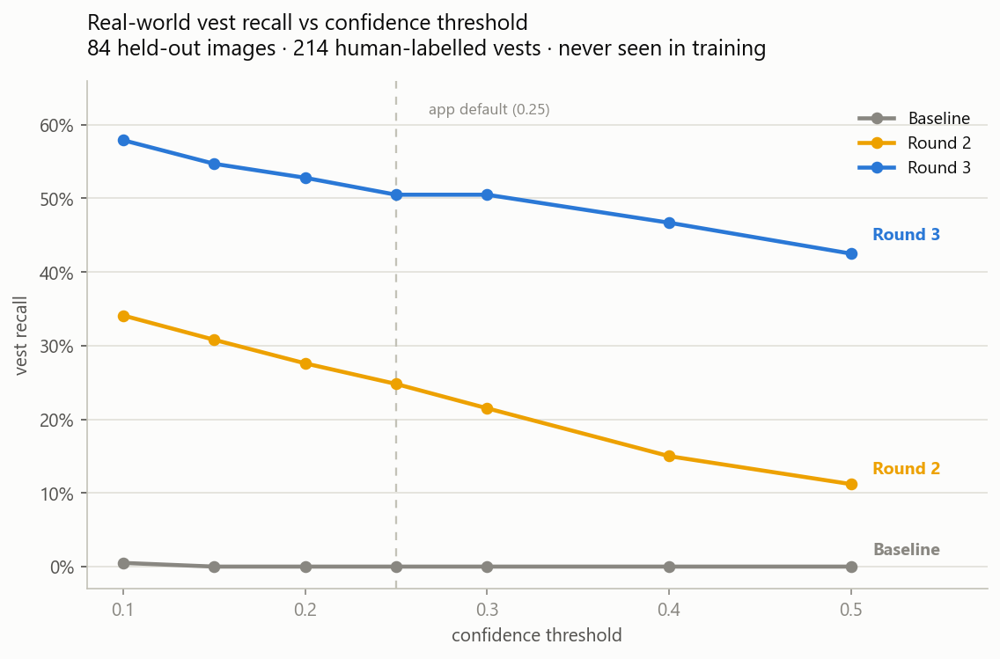
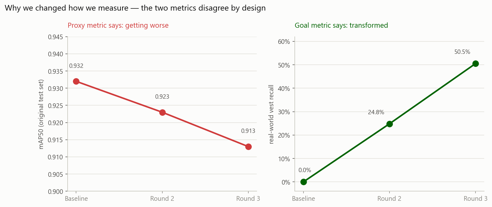

# PPE Compliance Detection

An end-to-end computer vision system that detects whether construction site workers are wearing required Personal Protective Equipment (hard hats and high-visibility vests). The system classifies each worker as compliant or non-compliant, draws bounding boxes around detections, and generates a compliance summary highlighting violations.

**Live Demo:** [ppe-detection-blush.vercel.app](https://ppe-detection-blush.vercel.app)

## Table of Contents

- [Architecture Overview](#architecture-overview)
- [Dataset & Data Pipeline](#dataset--data-pipeline)
- [Exploratory Data Analysis](#exploratory-data-analysis)
- [Model Training](#model-training)
- [Evaluation & Results](#evaluation--results)
- [Deployment](#deployment)
- [Frontend](#frontend)
- [Project Structure](#project-structure)
- [Known Limitations](#known-limitations)
- [Future Work](#future-work)
- [Setup & Reproduction](#setup--reproduction)
- [License](#license)

## Architecture Overview

```
 Data Pipeline          Training & Eval          Deployment
 ───────────            ───────────────          ──────────
 3 Public Datasets      YOLO11n (baseline)       HF Spaces (Gradio + ONNX)
       │                YOLO11s (primary)              │
  NB01: Merge &               │                 React + Vite Frontend
  Format Convert         NB07: Compare           (Vercel)
       │                       │                       │
  NB02: EDA              Best model ──────> ONNX Export + Docker
       │
  NB03: Augmentation
```

The pipeline follows a structured notebook workflow (NB01-NB08), covering data acquisition, exploration, preprocessing, training, evaluation, and deployment.

## Dataset & Data Pipeline

### Source Datasets

Three publicly available construction site PPE datasets were merged into a single unified dataset:

| Dataset | Images | Original Format | Contribution |
|---------|--------|-----------------|--------------|
| Construction Site Safety (Roboflow) | 2,801 | YOLO txt (10 classes) | Hardhat + vest annotations |
| SHWD (Safety Helmet Wearing Dataset) | 7,581 | VOC XML (non-standard `<n>` tag) | Largest source, helmet-focused |
| Pictor-PPE | 784 | TSV manifest (crowd-sourced) | Research variety |

### Pipeline Steps (NB01)

1. **Format conversion** — All datasets converted to YOLO txt format. SHWD required custom XML parsing for non-standard tags. Pictor-PPE required TSV-to-YOLO coordinate normalisation. CSS required class remapping from 10 to 5 classes (dropped Mask, Safety Cone, machinery, vehicle).
2. **Deduplication** — MD5 hashing removed 37 exact duplicates. Perceptual hashing removed 58 near-duplicates. 11,034 &rarr; 10,939 unique image-label pairs.
3. **Quality filtering** — Removed corrupted images, images below 200px minimum dimension, and invalid bounding boxes. 10,939 &rarr; 10,864 valid pairs.
4. **Stratified split** (80/10/10) — Stratified by source dataset to ensure each split contains representative samples from CSS, SHWD, and Pictor-PPE.

### Final Dataset

| Split | Images | Bounding Boxes |
|-------|--------|----------------|
| Train | 8,691 | ~116K |
| Val | 1,086 | ~14.5K |
| Test | 1,087 | ~14.5K |
| **Total** | **10,864** | **144,986** |

### 5 Unified Classes

| Class | Count | % of Total | Role |
|-------|-------|------------|------|
| `hardhat` | 12,074 | 8.3% | Compliant |
| `no-hardhat` | 113,252 | 78.1% | Violation |
| `vest` | 3,135 | 2.2% | Compliant (minority) |
| `no-vest` | 4,158 | 2.9% | Violation (minority) |
| `person` | 12,367 | 8.5% | Neutral |

The dataset exhibits significant class imbalance, with `no-hardhat` dominating at 78.1% and vest classes representing only ~5% combined. This imbalance was addressed through augmentation strategy in NB03.

## Exploratory Data Analysis

**NB02 & NB02b** performed forensic exploration of the merged dataset:

- **Class distribution analysis** across train/val/test splits confirmed consistent stratification
- **Spatial distribution heatmaps** revealed bounding box centre-point clustering patterns
- **Bounding box scale & aspect ratio analysis** showed wide variation (thumbnail to full-image)
- **Per-source statistics** quantified each dataset's contribution to class balance
- **Co-occurrence analysis** identified which classes typically appear together
- **Image quality sampling** assessed resolution, brightness, and contrast distributions

## Model Training

### Augmentation Strategy (NB03)

- **YOLO-native**: Mosaic (1.0), Mixup (0.15), Copy-Paste (0.15), Erasing (0.4)
- **Geometric**: Rotation (10 deg), Translation (0.1), Scale (0.5), Shear (2.0)
- **Colour**: HSV hue (0.015), saturation (0.7), value (0.4)
- **Minority class oversampling**: Vest (2x), No-vest (1.5x) via Albumentations (RandomFog, RandomRain, GaussNoise, MotionBlur)

### Shared Training Configuration

- **Image size**: 1280px
- **Epochs**: 100
- **Optimiser**: SGD (lr=0.01, momentum=0.937, weight_decay=0.0005)
- **Warmup**: 3 epochs
- **Loss weights**: box=7.5, cls=0.5, dfl=1.5
- **Hardware**: NVIDIA RTX 4060 (8 GB VRAM)

### YOLO11n — Baseline (NB04)

- **Parameters**: 2.6M
- **Batch size**: 8
- **Purpose**: Establish baseline performance and validate the data pipeline

### YOLO11s — Primary Model (NB05)

- **Parameters**: 9.4M
- **Batch size**: 4 (VRAM-limited)
- **Purpose**: Primary deployment model balancing accuracy and inference speed
- **All-in-one notebook**: Training + post-training evaluation in a single notebook

### RT-DETR-l — Transformer Model (NB06)

- **Status**: Deferred. At 93.2% mAP50, the marginal gain did not justify the estimated 40-50 hours of training time on the RTX 4060. Reserved for future work.

## Evaluation & Results

**NB07** provides a comprehensive side-by-side comparison of both trained models.

### Overall Performance

| Metric | YOLO11n | YOLO11s |
|--------|---------|---------|
| Parameters | 2.6M | 9.4M |
| Val mAP50 | 90.5% | **94.1%** |
| Test mAP50 | 88.6% | **93.2%** |
| Test mAP50-95 | 57.6% | **63.9%** |
| Inference | 5.7 ms (141 FPS) | 11.4 ms (77 FPS) |

### Per-Class AP50 (Test Set)

| Class | YOLO11n | YOLO11s | Delta |
|-------|---------|---------|-------|
| hardhat | 91.9% | 94.0% | +2.1% |
| no-hardhat | 95.6% | 96.6% | +1.0% |
| vest (minority) | 84.5% | **92.0%** | **+7.5%** |
| no-vest (minority) | 84.5% | **92.1%** | **+7.6%** |
| person | 86.2% | 91.5% | +5.3% |

YOLO11s was selected for deployment based on its superior performance across all classes, particularly the 7-8% improvement on minority vest classes, while maintaining real-time inference speed at 77 FPS.

### Real-World Vest Detection (NB09)

The in-distribution scores above turned out to be misleading for one class. Despite 92% AP50 on
`vest`, the deployed model detected almost no vests on arbitrary real photographs. Investigating
this became a separate piece of work — see
[NB09_Vest_Boost_Finetune.ipynb](notebooks/NB09_Vest_Boost_Finetune.ipynb).

**The measurement problem.** The original test split shares its sources, capture conditions and
vest styles with training, so it measures "can the model recognise *this* style of vest" rather
than "can it recognise vests". An independent benchmark was built from
[SH17](https://github.com/ahmadmughees/SH17dataset) (Pexels industrial photography): 84 held-out
images with 214 human-labelled vests, sharing no image with any training set.

**Result** — vest recall at the app's default confidence (0.25):

| Model | Real-world vest recall | Vest precision | hardhat AP50 | Deployed |
|-------|------------------------|----------------|--------------|----------|
| Baseline (NB05) | **0.0%** (0/214) | — | 0.940 | previously |
| Round 1 — naive merge | *withheld* | — | 0.914 ⚠ | no |
| Round 2 — pseudo-labelled | 24.8% (53/214) | 88.3% | 0.940 | no |
| **Round 3 — + variety** | **50.5%** (108/214) | 80.0% | 0.934 | **yes** |

**Key lesson.** Round 1 merged a vest-only dataset and *reduced* hard-hat accuracy by 2.6 points.
The vest dataset annotates only vest classes, so every unlabelled hard hat and worker in its
images trained as **background**. Merging a partially-labelled dataset into a multi-class detector
silently teaches the model to suppress the classes that dataset omits. The fix was to pseudo-label
the omitted classes with the current model before merging, which restored hard-hat accuracy while
keeping the vest gains.



The two metrics disagree by design — the in-distribution score declines while real-world recall
rises from zero to over half — because they reward different things. Deployment decisions follow
the goal metric, with the in-distribution scores retained as a regression guard on the non-vest
classes.



### Evaluation Artifacts

- Confusion matrices (side-by-side)
- Training dynamics (overlaid loss curves)
- Per-class AP50 comparison charts
- Minority class progression (epoch-by-epoch vest/no-vest AP)
- Radar plot (per-class performance)
- Speed vs. accuracy trade-off analysis
- Executive summary CSV (`nb07_final_summary.csv`)

## Deployment

### Backend (Hugging Face Spaces)

- **Framework**: Gradio (Spaces Gradio SDK; a Dockerfile is included for local container runs)
- **Model format**: ONNX (38 MB, CPU-optimised via onnxruntime)
- **Inference**: 640px input size, configurable confidence threshold (0.1-0.9). Input images
  are passed as PIL objects — raw numpy arrays are interpreted as BGR by Ultralytics, which
  silently channel-swaps colours and degrades vest detection.
- **Endpoints**: `/detect` (image) and `/detect_video` (clips up to 15 s)
- **Output**: Annotated image or **annotated MP4** + text compliance summary + structured JSON report
- **Video handling**: detection runs on sampled frames (2 fps) while boxes are drawn onto *every*
  frame, so the returned clip plays back smoothly instead of updating twice a second. Encoded as
  H.264 via `imageio-ffmpeg` — OpenCV's default `mp4v` output will not play in browsers.
- **Keep-alive**: GitHub Actions workflow pings the Space every 14 minutes to prevent cold
  sleep. Note: GitHub disables scheduled workflows after 60 days without repo commits — if
  the Space stops responding, re-enable the workflow from the Actions tab.

See [deployment/README.md](deployment/README.md) for backend-specific details.

### Frontend (Vercel)

- **Stack**: React 19 + Vite + Tailwind CSS
- **Features**: Image upload, video upload (10s max, frame-by-frame processing), confidence slider, dark mode, backend health indicator
- **Connection**: `@gradio/client` SDK communicates with HF Spaces backend

See [frontend/README.md](frontend/README.md) for frontend-specific details.

## Project Structure

```
PPE_Compliance_detection/
├── notebooks/
│   ├── NB01_Data_Acquisition.ipynb      # Dataset merge, format conversion, split
│   ├── NB02_Forensic_Exploration.ipynb  # EDA: class distribution, spatial analysis
│   ├── NB02b_forensic_exploration.ipynb # Supplementary: co-occurrence, quality
│   ├── NB03_Preprocessing.ipynb         # Augmentation strategy
│   ├── NB04_Training_YOLO11n.ipynb      # YOLO11n baseline (100 epochs)
│   ├── NB04c_Post_Training_Eval.ipynb   # YOLO11n checkpoint analysis
│   ├── NB05_Training_YOLO11s.ipynb      # YOLO11s primary model (all-in-one)
│   ├── NB06_Training_RTDETR.ipynb       # RT-DETR (deferred)
│   ├── NB07_Evaluation.ipynb            # Model comparison & benchmarking
│   ├── NB08_Deployment.ipynb            # ONNX export & HF Spaces setup
│   └── NB09_Vest_Boost_Finetune.ipynb   # Vest campaign: diagnosis, data strategy, deploy decision
├── data/
│   ├── processed/                       # Final dataset (images + labels)
│   ├── vest_boost/                      # Roboflow safety-vests, pseudo-labelled (gitignored)
│   ├── vest_boost2/                     # Hardhat+vest set, pseudo-labelled (gitignored)
│   ├── vest_boost_sh17/                 # SH17 train split, mapped + pseudo-labelled (gitignored)
│   ├── sh17_vest_test.txt               # 84 held-out benchmark image stems
│   ├── ppe_dataset.yaml                 # Original YOLO dataset config
│   ├── ppe_dataset_v3.yaml              # Round-3 config (vest sources, oversampled)
│   ├── hyp_ppe.yaml                     # Augmentation hyperparameters
│   └── training_config.json             # Model-specific training configs
├── deployment/
│   ├── app.py                           # Gradio web interface
│   ├── ppe_yolo11s.onnx                 # YOLO11s ONNX model (38 MB)
│   ├── Dockerfile                       # Container for local runs
│   ├── requirements.txt                 # Backend dependencies
│   ├── model_config.json                # Class names, violation mapping
│   ├── training_args.yaml               # Full training hyperparameters
│   └── examples/                        # Demo images
├── frontend/
│   ├── src/
│   │   ├── App.jsx                      # Main application logic
│   │   ├── api.js                       # Gradio client + backend wake/health
│   │   └── components/                  # React components
│   ├── package.json
│   └── vite.config.js
├── scripts/
│   ├── sh17_classmap.py                 # Verify SH17 class indices (paper order is wrong)
│   ├── realworld_vest_eval.py           # Held-out real-world vest benchmark
│   └── resume_round3_training.py        # Resume a paused fine-tune from last.pt
├── results/                             # Training logs, metrics CSVs, plots
│   ├── nb09_fig*.png                    # Vest-campaign figures (NB09)
│   └── weights/
│       ├── ppe_yolo11s.pt               # NB05 baseline weights
│       └── ppe_yolo11s_vboost_r3.pt     # Deployed round-3 weights
├── .github/workflows/keep-alive.yml     # Prevent HF Space cold sleep
└── requirements.txt                     # Full Python environment
```

## Known Limitations

1. **Vest recall is 50.5%, not 95%** — the deployed model still misses about half of real-world
   vests. This went from unusable (0%) to useful, not to solved. Two earlier causes were found and
   fixed along the way: an inference-path bug that channel-swapped RGB/BGR (turning orange vests
   blue before the model saw them), and a partial-label merge that suppressed classes. See
   [NB09](notebooks/NB09_Vest_Boost_Finetune.ipynb).

2. **The held-out benchmark shares a source with part of training** — round 3 trained on 128 SH17
   images and is evaluated on 84 *different* SH17 images. A perceptual-hash leakage guard enforces
   zero image overlap, but the test distribution is closer to training for round 3 than for round 2
   (whose 24.8% was fully cross-domain). Round 3's advantage is real but partly reflects
   distribution adaptation.

3. **`no-vest` is not measured in the real world** — no independent dataset labels "person without
   a vest", so the violation class is only measured in-distribution, where it fell ~5 points. This
   is the weakest-evidenced part of the result.

4. **Precision/recall trade** — round 3 buys 25.7 points of recall for 8 points of vest precision
   (80% at the default threshold). Appropriate for compliance screening, where a missed violation
   costs more than a false alarm, but it is a deliberate trade rather than a free win.

5. **Class imbalance** — `no-hardhat` represents 78% of all annotations. Augmentation and
   oversampling mitigate this during training, but vest classes remain the scarcest signal: the
   original 15,480-image training pool contributes **zero** vest boxes, so all vest signal is
   imported from added datasets.

6. **CPU inference latency** — The HF Spaces free tier runs on CPU. Single-image inference takes 2-4 seconds. Video processing (20 frames) takes proportionally longer.

7. **15-second video limit** — clips are capped at 15 seconds because the whole video is processed
   server-side on a free CPU tier. A 12-second clip takes roughly 25-30 seconds end to end.

## Future Work

- **RT-DETR training** — Train the RT-DETR-l transformer-based detector (NB06) for comparison against the YOLO family. Expected to improve on fine-grained vest detection due to the attention mechanism, though at higher computational cost.
- **Expanded vest training data** — Curate additional vest-specific images covering a wider range of vest colours, styles, and occlusion scenarios to improve real-world vest detection.
- **Real-time video streaming** — Implement webcam/RTSP stream processing with `model.track()` and ByteTrack for continuous monitoring scenarios.
- **Edge deployment** — Export YOLO11n to TensorRT/CoreML for on-device inference on mobile or embedded hardware.
- **Multi-PPE expansion** — Extend to additional PPE classes (safety goggles, gloves, boots) with appropriate training data.

## Setup & Reproduction

### Prerequisites

- Python 3.11+
- NVIDIA GPU with CUDA (for training; inference runs on CPU)
- Node.js 18+ (for frontend)

### Backend (Local)

```bash
cd deployment
pip install -r requirements.txt
python app.py
# Opens Gradio interface at http://localhost:7860
```

### Frontend (Local)

```bash
cd frontend
npm install
echo "VITE_SPACE_ID=nduka1999/PPE" > .env
npm run dev
# Opens React app at http://localhost:5173
```

### Training (Reproduce from scratch)

```bash
pip install -r requirements.txt
# Run notebooks NB01 through NB08 in order
# Requires ~8 GB VRAM GPU, ~3 hours per model
```

## License

MIT
